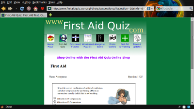

wQuiz
=====

A web based quiz engine written in PHP. It allows you to run your own quiz installed on a LAMP (Linux Apache Mysql PHP).

It is currently used on [First Aid Quiz](http://www.firstaidquiz.com) and the [PenguinTutor LPI Certification practice exams](http://www.penguintutor.com).

See docs folder for install and configuration instructions.

The project home page is on [PenguinTutor wQuiz project page](http://www.penguintutor.com/wquiz.php)

Current version is tested for PHP 8.0 

@Copyright Stewart Watkiss
Licensed under GPL 3
